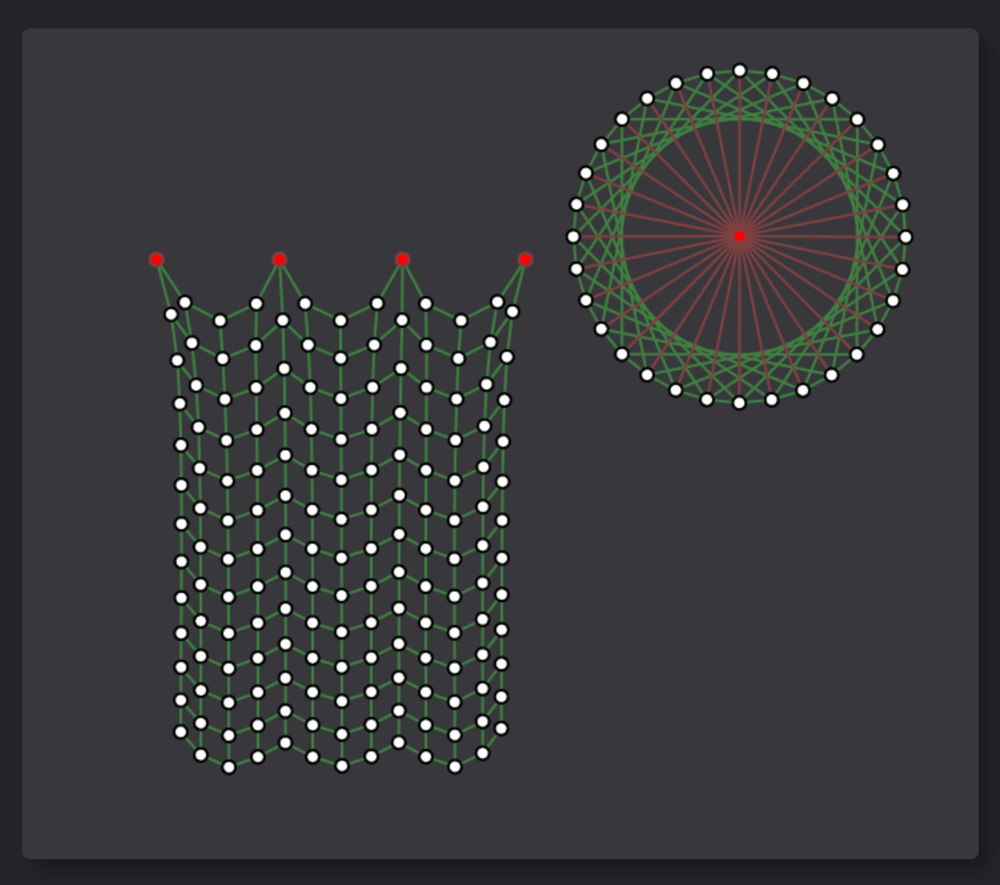

# Verlet

#### A basic 2D Verlet integration physics simulator.

## License

Please read the [license](LICENSE) to understand what you can and cannot do with this repository.

## Disclaimer

#### __*This project is in its infancy and will have many bugs and unoptimized code!*__

Do not use this project in an environment that requires any level of stability and reliability!
If you find any errors or have any suggestions, please do not hesitate to open an issue in this repository.
I aim to make this project user-friendly and intuitive, so any feedback is greatly appreciated.

## Usage

There is a demo implementation in the <a href="impl/"><code>impl</code></a> directory of this project.
Simply open the <a href="impl/index.html"><code>impl/index.html</code></a> file in the browser of your choice.